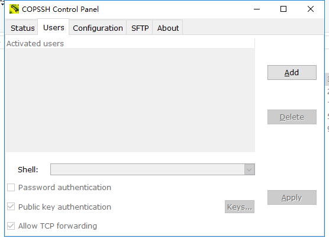
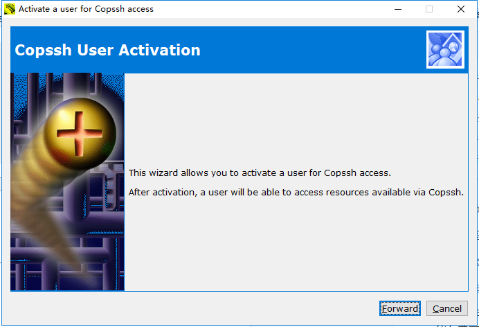
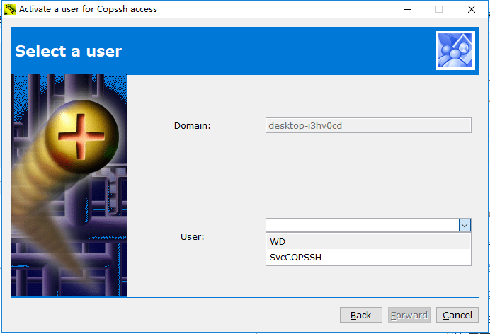
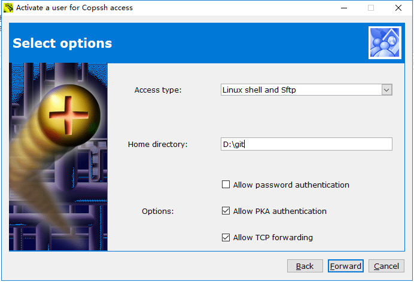
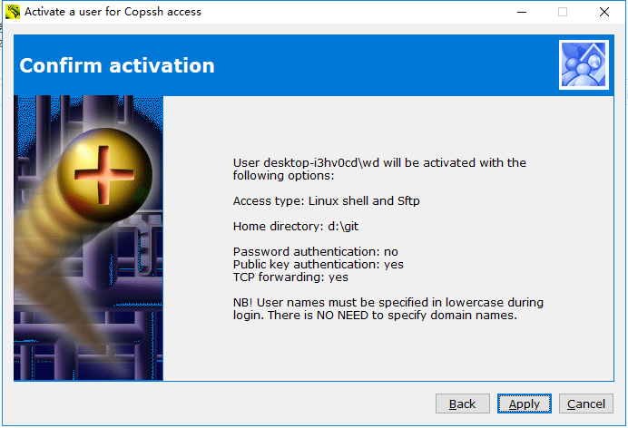
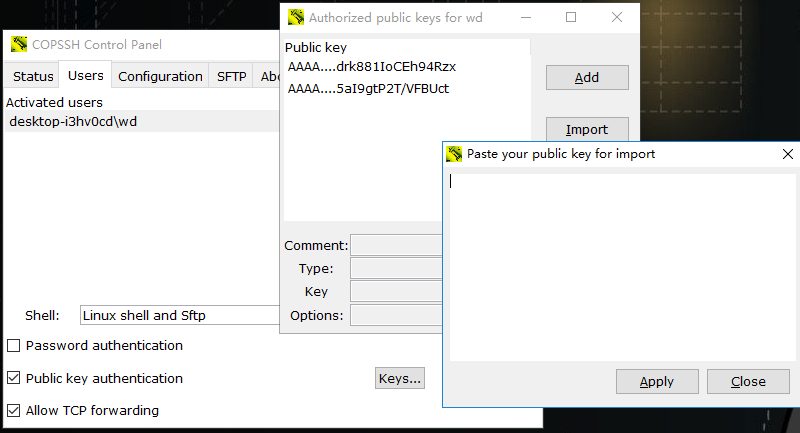
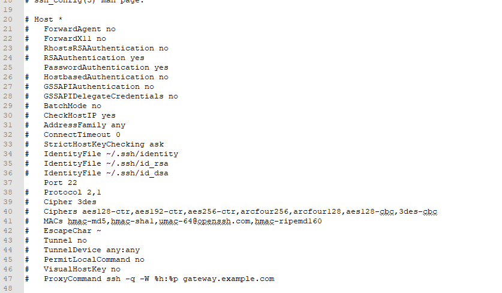

> Linux常用命令记录

# git命令

添加修改到缓存区：git add \<file\>

将缓存区内容提交：git commit -m "\<describe\>"

将本地分支提交到远程：git push origin master

将远程库克隆到本地：git clone git@github.com:zfky/librec.git

将远程仓库到修改同步到本地：  
- 查看远程仓库：git remote -v（要cd到本地仓库目录下）  

- 将远程仓库到master分支下载到本地：git fetch origin master  

- 比较本地仓库和远程的区别：git log -p master.. origin/master(按p退出)  

- 下载下来到代码合并到本地仓库：git merge origin/master


创建本地git仓库：

1. 创建SSH Key。在用户主目录下，看看有没有.ssh目录，如果有，再看看这个目录下有没有`id_rsa`和`id_rsa.pub`这两个文件，如果已经有了，可直接跳到下一步。如果没有，打开Shell（Windows下打开Git Bash），创建SSH Key：

   ~~~
   $ ssh-keygen -t rsa -C "youremail@example.com"
   ~~~

   你需要把邮件地址换成你自己的邮件地址，然后一路回车，使用默认值即可，由于这个Key也不是用于军事目的，所以也无需设置密码。

   如果一切顺利的话，可以在用户主目录里找到`.ssh`目录，里面有`id_rsa`和`id_rsa.pub`两个文件，这两个就是SSH Key的秘钥对，`id_rsa`是私钥，不能泄露出去，`id_rsa.pub`是公钥，可以放心地告诉任何人。

2. 登陆GitHub，打开“Account settings”，“SSH Keys”页面：

   然后，点“Add SSH Key”，填上任意Title，在Key文本框里粘贴`id_rsa.pub`文件的内容。

> windows下使用git搭建局域网仓库

主要借鉴以下两篇文章：

[Windows10 Git CopSSH](https://blog.csdn.net/u012348774/article/details/55189288)

[windows下搭建Git服务器](https://blog.csdn.net/u012150179/article/details/17029731)

前期工作：安装[Git](https://www.git-scm.com/download/)和[Copssh](http://taimienphi.vn/download-copssh-3601/6.0.0-phien-ban)(Copssh下载资源比较难找，csdn上都要积分，结果我google到了一个越南的网站能能免费下载。。。我用的是5.1.21版本)

配置Copssh：

1. 安装完成点击标签栏上的Users



2. 点击Add按钮添加用户



点Forward



选择上面的用户名





修改Home directory中的路径，这个路径即是作为远程仓库的路径，注意去掉下面Allow password authentication的勾选，因为我们用公似钥来登录，不用密码来登录。接着点击Foward，再点击Apply完成用户添加。

3. 添加公钥



在添加完用户的界面点击Keys，然后点击Import将要使用远程仓库的电脑的公钥复制过后粘贴进去。

4. 打开copssh安装路径etc/目录下，修改ssh_config文件,去掉PasswordAuthentication和Port前面的#。



5. 将git安装目录下mingw/bin中所有文件拷贝到Copssh安装目录/bin中。
6. 到了这里，我们就可以使用我们的私钥来登录这个ssh服务器了，打开“Git Bash”。在命令行里输入

```
ssh wd@ip
```

ip就是你搭建远程仓库那台电脑的ip

没报错，就表示连接到了ssh服务器，然后依次使用下列命令

```
mkdir test.git
cd test.git
git init --bare
```

新建一个名为test.git的文件，并在其中建立一个纯git仓库。

使用exit命令退出ssh服务器

然后在你电脑上进入想要作为仓库的目录然后执行

~~~
git clone wd@ip:test.git
~~~

这样就从远程仓库克隆了一个git的仓库。


# Linux常用命令

删除文件夹：rm /usr/java -rf

编辑文件：vim /etc/profile（按i进去insert模式编辑，按wp保存退出）

移动文件：cp /mnt/hgfs/linux/jdk-8u60-linux-x64.tar.gz /usr/java/


# [markdown语法](http://www.appinn.com/markdown/#p "Title")（只是方便自己看。。。）


